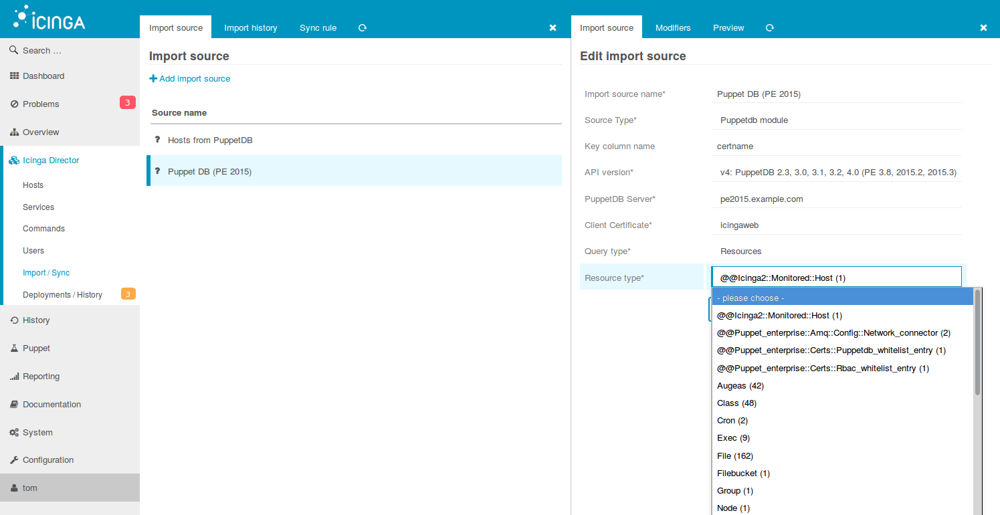

Icinga Web 2 PuppetDB module
============================

The main purpose of this module is to provide a PuppetDB import source
for [Icinga Director](https://github.com/Icinga/icingaweb2-module-director/blob/master/README.md).
As of this writing it has not even a GUI or CLI component, but this may
change in future.

To install, please refer to our documentation. [Installation and configuration](doc/01-Installation.md)

_Note: Some steps require you to be familiar with Puppet/PuppetDB_

Screenshot
----------

